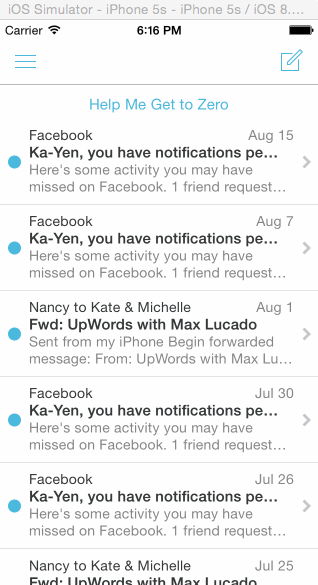

# iOS prototype of Mailbox app

This is an iOS prototype of Mailbox, completed for Codepath. [See this week's assignment](http://courses.codepath.com/courses/ios_for_designers/week/3#!assignment).

__Time spent:__ About 15 hours

__Project Requirements__

On dragging the message left...

* [x] Initially, the revealed background color should be gray.
* [x] As the reschedule icon is revealed, it should start semi-transparent and become fully opaque. If released at this point, the message should return to its initial position.
* [x] After 60 pts, the later icon should start moving with the translation and the background should change to yellow.
  * [x] Upon release, the message should continue to reveal the yellow background. When the animation it complete, it should show the reschedule options.
* [x] After 260 pts, the icon should change to the list icon and the background color should change to brown.
  * [x] Upon release, the message should continue to reveal the brown background. When the animation it complete, it should show the list options.

* [x] User can tap to dismissing the reschedule or list options. After the reschedule or list options are dismissed, you should see the message finish the hide animation.

On dragging the message right...

* [x] Initially, the revealed background color should be gray.
* [x] As the archive icon is revealed, it should start semi-transparent and become fully opaque. If released at this point, the message should return to its initial position.
* [x] After 60 pts, the archive icon should start moving with the translation and the background should change to green.
  * [x] Upon release, the message should continue to reveal the green background. When the animation it complete, it should hide the message.
* [x] After 260 pts, the icon should change to the delete icon and the background color should change to red.
  * [x] Upon release, the message should continue to reveal the red background. When the animation it complete, it should hide the message.
* [x] Optional: Panning from the edge should reveal the menu
  * [x] Optional: If the menu is being revealed when the user lifts their finger, it should continue revealing.
  * [x] Optional: If the menu is being hidden when the user lifts their finger, it should continue hiding.
* [ ] Optional: Tapping on compose should animate to reveal the compose view.
* [ ] Optional: Tapping the segmented control in the title should swipe views in from the left or right.
* [ ] Optional: Shake to undo.

__Notes__

* I created a "reset" button so I could show multiple effects in the singleMessageView, even after the feed collapses
* After the edge pan gesture opens the scroll from the left, I triggered a pan gesture that will allow the user to collapse it after a certain location point.
* Playing with pulling functions out of the actions and calling them inside the actions, so they are reusable and the code looks cleaner.

### Walkthrough of app

gif created with [licecap](http://www.cockos.com/licecap)
